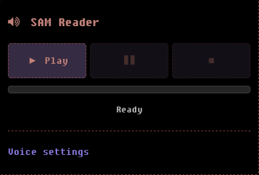

<div align="center">

# hexo-sam-reader



A [Hexo](https://hexo.io) _plugin_ that adds a **[SAM (Software Automatic Mouth)](https://github.com/discordier/sam)** _text-to-speech_ (TTS) reader widget to your blog posts. SAM reads your post content aloud.

See demo by going to [blog.trintler.me](https://blog.trintler.me), go to any post, and check the sidebar.

Made with love by [trintlermint](#credits).

</div>

<!--toc:start-->

- [Installation](#installation)
  - [npm](#npm)
  - [pnpm](#pnpm)
  - [GitHub](#github)
  - [Clone](#clone)
- [Usage](#usage)
  - [Enable SAM](#enable-sam)
  - [Add helper](#add-helper)
- [Configuration](#configuration)
  - [Abbreviations](#abbreviations)
  - [Styling](#styling)
  - [Text cleaning](#text-cleaning)
- [Inside out](#inside-out)
- [Credits](#credits)
- [License](#license)
<!--toc:end-->

## Installation

### npm

```bash
npm install hexo-sam-reader
```

### pnpm

use this if you have `pnpm-lock.yaml` instead:

```bash
pnpm install hexo-sam-reader
```

### GitHub

```bash
npm install github:trintlermint/hexo-sam-reader
```

### Clone

```bash
git clone https://github.com/trintlermint/hexo-sam-reader.git
npm install ./hexo-sam-reader
```

## Usage

### Enable SAM

Add `sam: true` to any given post's front matter:

```yaml
---
title: my-post
date: 2026-01-01
sam: true
---
```

### Add helper

In your theme's sidebar or meta partial (e.g. `layout/_partial/post/meta.ejs`), call the helper:

```ejs
<%- sam_reader() %>
```

> [!NOTE]
> I know this feels impractical to need to setup, however this is to allow more freedom for you, the end user.

The widget only renders on posts where `sam: true` is set.

## Configuration

Add a `sam_reader` section to your site's `_config.yml`. All fields are optional and fall back to sensible defaults.

```yaml
sam_reader:
  # Front matter key that enables SAM on a post for `sam:true` (default: 'sam')
  # if you change this, ensure you change the front matter on your posts to the key you changed to.
  front_matter_key: sam

  # CSS selector for the post content container
  content_selector: ".mypage" # for example, for default landscape theme use `".e-content"`

  # where bunddled generator.js is served (default: /js/hexo-sam-reader)
  asset_path: "/js/hexo-sam-reader"

  # Default voice settings (adjustable per-session via sliders) (resets to default after ctrl+r)
  # If you change the settings mid SAM talking, pause him and start him again to see change.
  # See https://discordier.github.io/sam/demos.html for demo
  speed: 72 # 20-200
  pitch: 64 # 0-255
  mouth: 128 # 0-255
  throat: 128 # 0-255

  # silence duration (ms) inserted between sections e.g. H1 -> H2
  pause_ms: 400

  # max characters per SAM chunk, longer text is split at sentence/comma boundaries
  chunk_max_length: 200

  # extra CSS selectors to skip when extracting text (comma-separated)
  # these are added to the built-in skip list (pre, script, style, .highlight, etc.)
  # this is so that SAM doesnt recite things which are irrelevant.
  skip_selectors: ".my-widget, .ad-banner"

  # abbreviation map: keys are matched as whole words and replaced before speaking.
  # all-cap keys are case-sensitive and mixed-case keys are case-insensitive.
  # this is important when sam-reader.js translates your stuff for sam.js to read
  abbreviations:
    SSH: "S S H"
    CLI: "C L I"
    API: "A P I"
    HTML: "H T M L"
    CSS: "C S S"
    LaTeX: "lay-tech"
    CMake: "see-make"

  # widget styling
  style:
    background: "#000"
    border_color: "#924a41"
    text_color: "#c08179"
    button_bg: "#352b42"
    button_hover_bg: "#924a41"
    button_active_bg: "#493aa5"
    button_active_border: "#867ade"
    progress_bg: "#252525"
    progress_bar: "#867ade"
    progress_border: "#3a3a3a"
    status_color: "#bbb"
    config_accent: "#867ade"
    font_family: "DOS, SimHei, Monaco, Menlo, Consolas, 'Courier New', monospace"
```

### Abbreviations

The `abbreviations` map replaces whole-word matches before text is sent to SAM. This is useful for acronyms, technical terms, or any word SAM mispronounce.

> [!TIP]
> You can just chek by testing SAM a ton of times, I will make a reliable list in the future.

```yaml
abbreviations:
  # spell out acronyms
  ICPC: "I C P C" # for example, if this isnt done it will be pronounced as "ikpk", not what we want haha
  GPU: "G P U"
  WASM: "web assembly"
  LaTeX: "lay-tech"
  nginx: "engine-x"
  # shorthands
  "e.g.": "for example"
  "i.e.": "that is"
```

### Styling

You only need to specify the colors you want to change. Unspecified values use the defaults.

```yaml
# example: green-themed widget (like freemind.bithack!)
sam_reader:
  style:
    border_color: "#2d5a27"
    text_color: "#7ec876"
    button_bg: "#1a3a15"
    progress_bar: "#4caf50"
    config_accent: "#4caf50"
```

### Text cleaning

The following transformations are always applied (not configurable):
| Input | Spoken as |
| ------------ | -------------------------- |
| `>=` | "greater than or equal to" |
| `<=` | "less than or equal to" |
| `!=` | "not equal to" |
| `===` | "strictly equals" |
| `==` | "equals" |
| `>` | "greater than" |
| `<` | "less than" |
| `/` (spaced) | "OR" |
| `/` | "slash" |

> [!NOTE]
> I will be changing this from being not configurable but for me this is of most ease, wait for new releases please.

> [!NOTE]
> URLs, email addresses, footnote markers such as (`[^1]`), and non-ASCII characters are stripped.

## Inside out

1. _Generator_; (`lib/generator.js`) serves the bundled `sam.js` library as a virtual Hexo asset at the configured `asset_path`.
2. _Helper_; (`lib/helper.js`) renders the widget HTML/CSS/JS when `<%- sam_reader() %>` is called in a template.
3. On the client side, the widget extracts text from the post content container, cleans it for `sam.js`, splits it into chunks, and plays them sequentially using the Web Audio API (see credits on how discordier did it.)

## Credits

- [sam.js](https://github.com/discordier/sam) by discordier, JS port of SAM
- Original SAM by Don't Ask Software (Mark Barton), 1982

## License

MIT; 2026 Niladri Adhikary
